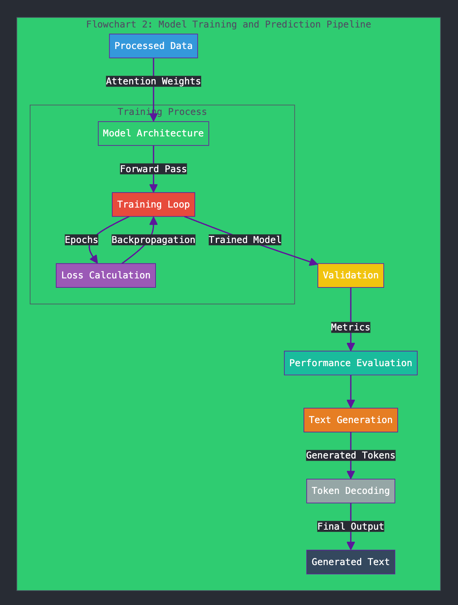

# Text Generation Using Spark
#### Author: Niharika Belavadi Shekar
#### UIN: 675234184
#### Email: nbela@uic.edu
#### Instructor: Mark Grechanik

## Project Summary
This project focuses on generating text based on a given input sequence (also known as the seed text) using Apache Spark. Spark is significantly faster than Hadoop and serves as a reliable distributed computing system for parallel data processing. The goal is to take a seed text as input and generate a continuation of that text. For example, if the seed text is "Once upon a time," the generated text could be "there lived a prince in a kingdom."

The text generation is achieved using a sliding window approach along with vector and positional embeddings, coupled with an attention mechanism. Here's a brief overview of the process:

1. **Input Seed Text**: The user provides a seed text.
2. **Token Encoding**: The words in the input text are encoded into tokens.
3. **Sliding Window**: A set of sliding windows is created which contains a input sequence and its target token.
4. **Vector and Positional Embeddings**: Tokens are converted to vector embeddings, which represent the context of the word, while positional embeddings indicate the relative position of each word in the sentence. An embedding matrix is formed that combines both types of embeddings, giving each token contextual and positional significance.
5. **Attention Mechanism**: The attention mechanism is applied to the embedding matrix to assign weights to each token. This mechanism utilizes three matrices—Query, Key, and Value:
   - **Query Matrix**: Identifies the importance of other words to the current word.
   - **Key Matrix**: Indicates the importance of the current word to others.
   - **Value Matrix**: Contains the vector embeddings for the current word.
     The dot product of the query and key matrices determines how much attention one word should give to another, yielding attention weights.
6. **Flattening and Model Training**: The output is flattened to ensure the correct input format. The model is then trained with this data over a specified number of epochs. After training, the model is validated to assess accuracy, loss, and memory usage.
7. **Text Prediction**: The trained model can predict the next sequence of text based on the seed input using Spark.

For a visual overview of the project, please check out the [YouTube Link](https://youtu.be/o4kjQ91r0mM).

## Prerequisites
To successfully run the project, ensure the following prerequisites are met (the operating system used is macOS):

1. **Apache Spark**: Set up Spark locally or on a cluster.
2. **DeepLearning4J (DL4J)**: Integrated into the project for neural network-based text generation.
3. **Java 11**: Ensure JDK 11 is installed.
4. **Scala 2.13**: The project is compatible with Scala 2.13.
5. **Amazon S3**: Access credentials for S3 if using a cloud environment for file storage.
6. **IDE (IntelliJ IDEA recommended)**: An IDE for development and configuration management.
7. **sbt (Scala Build Tool)**: For building and managing project dependencies.

Ensure all dependencies and libraries are properly configured for the project.

## Steps to Execute the Project

1. **Clone the Repository**
   ```bash
   git clone git@github.com:NiharikaShekar/TextGeneration_LLM.git
   ```

2. **Install Dependencies**
   Navigate to the project directory and install the necessary dependencies:
   ```bash
   cd TextGeneration_LLM
   sbt clean update
   sbt clean compile
   ```

3. **Build the Project**
   Build the project using sbt assembly to compile and package it:
   ```bash
   sbt assembly
   ```

4. **Run Tests**
   Execute unit tests and integration tests using:
   ```bash
   sbt test
   ```

5. **Run the Application**
   Run the main class which is the entry point of the application:
   ```bash
   Text_Generation
   ```

6. **Submit the Application to Spark**
   To run the application on a Spark cluster, use the following command:
   ```bash
   spark-submit --class Text_Generation \      
     --master "local[*]" \
     --executor-memory 4G \
     --total-executor-cores 4 \
     target/scala-2.13/LLM-hw2-assembly-0.1.0-SNAPSHOT.jar
   ```
### The flow of the program is depicted in the below diagrams:
#### 1. Text Processing:

#### 2. Model Training and Prediction:

## Additional Information
- **Customization**: Users can modify the seed text to generate different continuations based on their inputs.
- **Model Training**: The number of epochs for training can be adjusted to improve the model's performance based on the dataset size and complexity.

Feel free to reach out via email for questions or collaborations!
